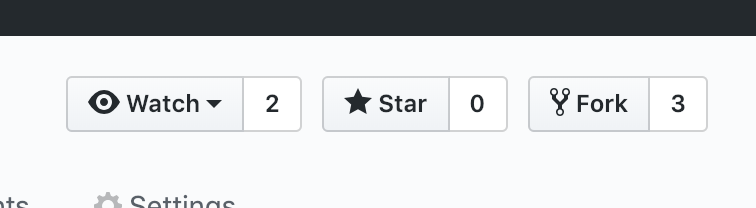

# CONTRIBUTING

### Do you want to  contribute?

At this time, contributions are only accepted by team members. We will open contribution to the public once the project basis has been finished.

If you find any bugs and you would want us to solve them, kindly open an "Issue" on this Github respository.

For `Milestone 1` team members will add any changes via `forking`:

#### How to fork?
Go to the main respository [here](https://github.com/UBC-MDS/AudioFilters_R).

On the right top corner, click on the `Fork` button.



Go to your forked version of this respository.
Clone that repository using the commands:

```
git clone
```
And add your sash key.
You can find this key under the Green Clone or Download button:


Once you cloned your respository, set up the original repository as the upstream master. Do this from the terminal using the following commands:

```
git remote add upstream https://github.com/UBC-MDS/AudioFilters_R.git

git fetch upstream
git merge upstream/master
```

#### Updating your Forked repository

Whenever you want to update your own forked repository from the master repository, use the last two commands together, they work like a `git pull` and save it to your local computer.

If you want to update your forked version, use `git push` to send the new changes from your local computer to your forked GitHub repository.

#### Submitting NEW work:

When you want to submit new work that you developed, you must push all your changes to your forked version. Then, please send a `pull request`.

To do this, in your forked version, on the `Pulls` tab, click on the `Pull Request` option.


Follow the instructions the screen will give you. We will review your `Pull Request` once we receive it. Either of the contributors has full authority to merge changes and make adjustments as neccessary.

#### Raising Issues
Please raise an issue for any and all things! As a courtesy, please tag all of the contributors.

#### Commit Messages
Commit messages help us know what was done. Keep them simple and meaningful.

#### Directory Structure
Keep all documents in the correct folder, when in doubt, ask the contributors through a Github Issue. Remember to cite any sources.


## Attribution

This Code of Conduct is adapted from the Contributor Covenant, version 1.0.0, available at https://www.contributor-covenant.org/version/1/0/0/code-of-conduct.html
